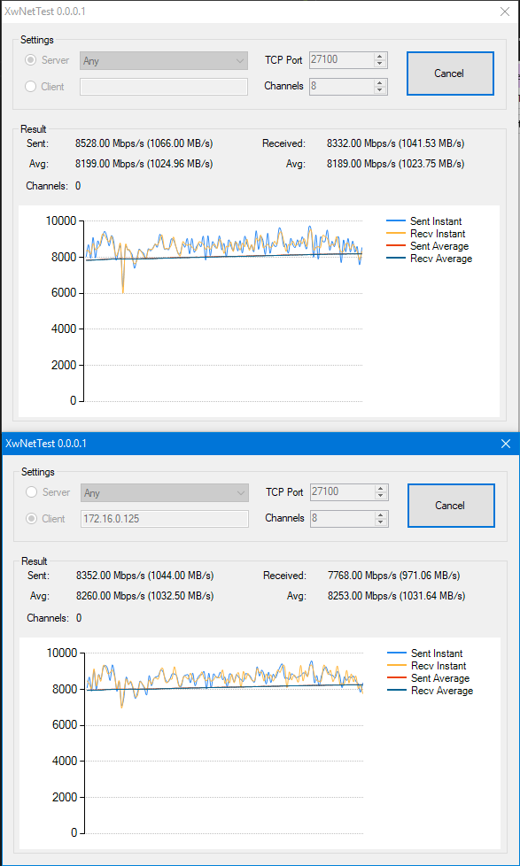

# XwNetTest

A simple network speed test between two PCs

- Set one PC as server (don't forget to open the firewall)
- Set the other as a Client and give it the server IP

## In case you are feeling generous  
